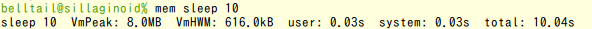
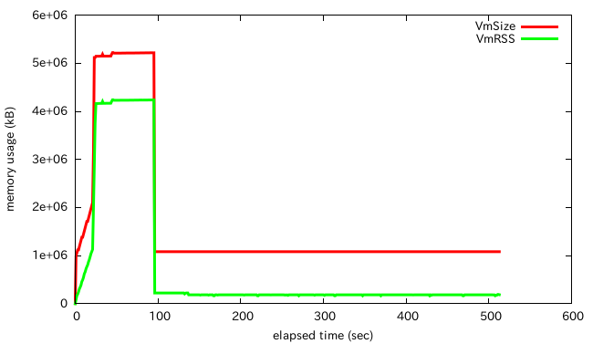

# mem.py

## About

**mem.py** is a memory monitoring utility inspired by time command.

* Show VmPeak and VmHWM, peak usage of virtual and real memory consumption respectively, of the child process as well as execution time.


* Watch memory consumption (VmSize, VmRSS) and export to a file with gnuplot format


For details about Vm\*, refer http://linux.die.net/man/5/proc

## Requirement

* Python: >= 2.7.9, >= 3.4.2
* OS: Linux >= 3.13 / Mac OSX Yosemite
* (optional) gnuplot 4.6

## Installation

```
% git clone https://github.com/belltailjp/mem
% sudo ln -s $PWD/mem/mem.py /usr/local/bin/mem
% rehash
```

## Usage

### General usage (show memory consumption)

For most purpose, you can simply insert `mem` at the head of a command, like `time` command.

```
% mem echo foo bar
foo bar
echo foo bar  VmPeak: 4.3MB  VmHWM: 188.0kB  user: 0.03s  system: 0.03s  total: 0.10s
```

### Change measurement interval

*mem.py* watches status of the child process with a certain interval, 100ms by default.

To improve accuracy or reduce CPU usage, you can change the interval.

```
% mem --interval 1000 echo foo bar
foo bar
echo foo bar  VmPeak: 4.3MB  VmHWM: 192.0kB  user: 0.03s  system: 0.03s  total: 1.00s
```

Note that *mem.py* will be running until the first interval finishes even if the child process ends immediately.

### Draw memory consumption graph with gnuplot

*mem.py* also allows you to watch transition of memory consumption.

```
% mem --watch memory_usage.plot ./train.py
./trainer.py  VmPeak: 5.6GB  VmHWM: 5.2GB  user: 1760.16s  system: 860.04s  total: 725.93s
% gnuplot
> set xlabel 'elapsed time (sec)'
> set ylabel 'memory usage (kB)'
> plot "memory_usage.plot" using 1:2 w l t "VmSize" lw 3, "memory_usage.plot" using 1:3 w l t "VmRSS" lw 3
```

Then you can get the graph shown above.

If more precise (frequent) measure is necessary, you can also specify the interval.

## License

MIT license

